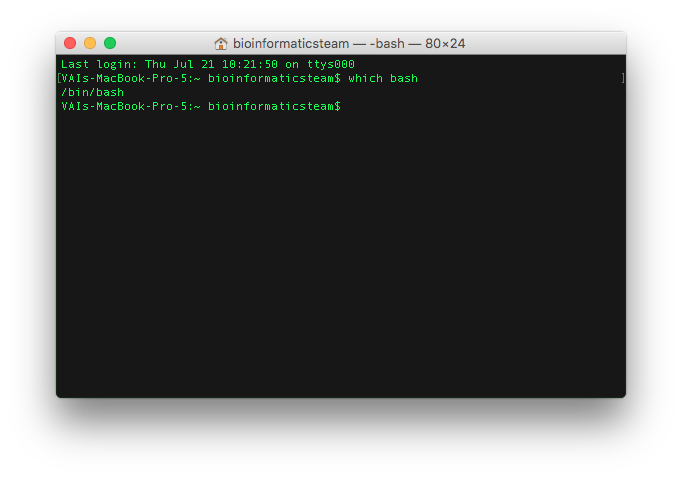
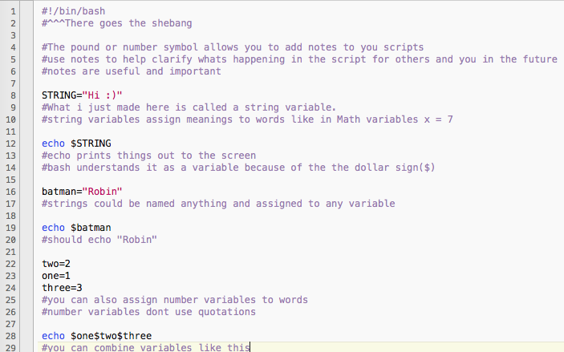
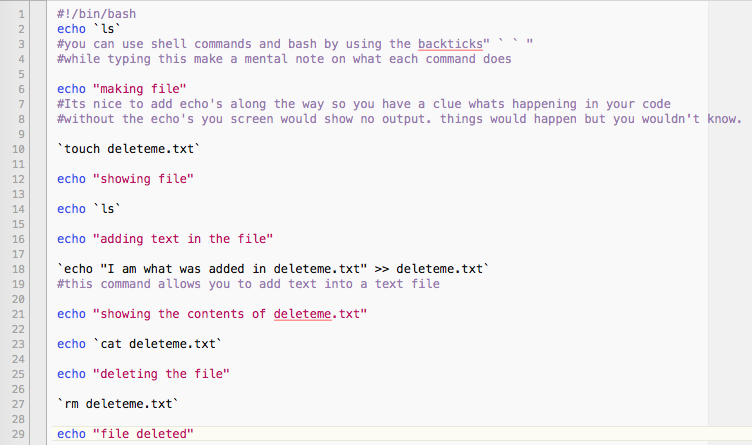
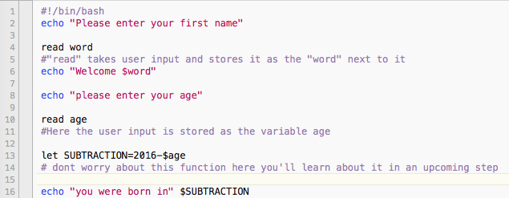
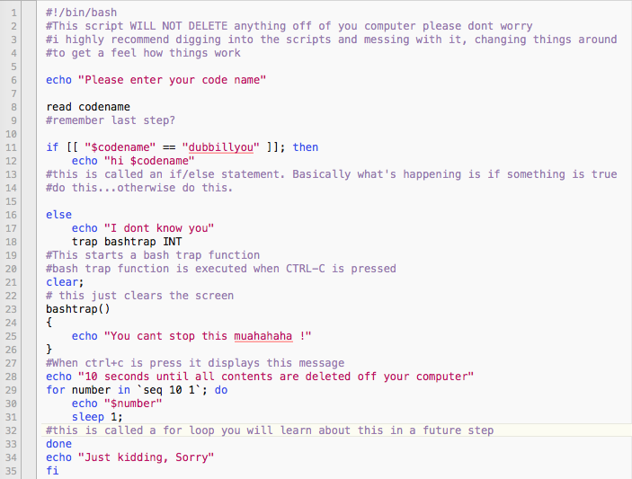
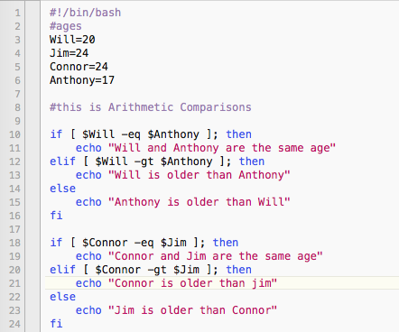
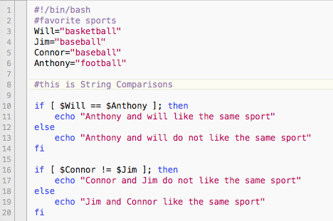
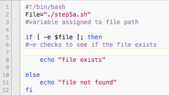
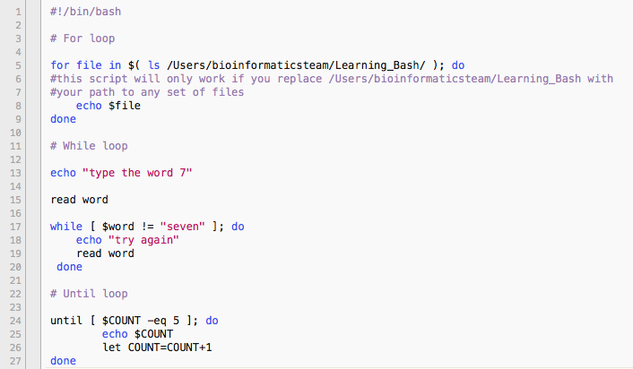
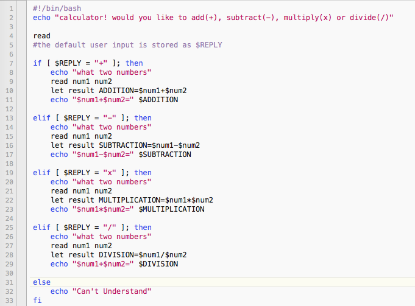

.. _bash:

Bash Scripting
==============

What is Bash Scripting?
-----------------------
A Bash script is a plain text file which contains a series of commands. These commands then tell your computer what it should do.

**Tutorial**
--------
Step 0
------
We should first locate your bash interpreter. To do so we enter ``which bash`` into the terminal.  
It should look like this: 

We should also find a text editor for bash. I use `TextWrangler <http://www.barebones.com/products/textwrangler/download.html>`_. Download one you like and learn how to use it.

Step 1: Variables
------
All bash shell scripts start with a **shebang** ``#!`` followed by the location of your bash interpreter.
Create a directory named Learning_Bash. In Learning_Bash create a file named step1.sh (*all bash scripts end in .sh*)

Before running the file, you must first make it executable. To make it executable you must type into terminal ``chmod +x step1.sh``. To run the bash script you must then type into terminal ``./step1.sh``

Step 2: Shell Commands in Bash
------------------------------

        
*Again you must make every file executable by typing* `chmod +x filename` *into the command line and to run the file you must type* `./filename` *in the command line.* Another way to run bash scripts is typing ``bash step2.sh``.

Step 3: User Input
------------------

Step 4: If/ Else Statements
---------------------------

        
Step 5: Comparisons
-------------------
+------------------------+
| Arithmetic Comparisons |
+-----------+------------+
| -lt       | <          |
+-----------+------------+
| -gt       | >          |
+-----------+------------+
| -le       | <=         |
+-----------+------------+
| -ge       | >=         |
+-----------+------------+
| -eq       | ==         |
+-----------+------------+
| -ne       | !=         |
+-----------+------------+

        
+--------------------------------+
|        String Comparisons      |
+-------+------------------------+
| =     | equal                  |
+-------+------------------------+
| !=    | not equal              |
+-------+------------------------+
| <     | less then              |
+-------+------------------------+
| >     | greater then           |
+-------+------------------------+
| -n s1 | string s1 is not empty |
+-------+------------------------+
| -z s1 | string s1 is empty     |
+-------+------------------------+
        

        
Step 6: File Testing
--------------------
+------------------+------------------------------------------------------------+
| -b filename      | Block special file                                         |
+------------------+------------------------------------------------------------+
| -c filename      | Special character file                                     |
+------------------+------------------------------------------------------------+
| -d directoryname | Check for directory existence                              |
+------------------+------------------------------------------------------------+
| -e filename      | Check for file existence                                   |
+------------------+------------------------------------------------------------+
| -f filename      | Check for regular file existence not a directory           |
+------------------+------------------------------------------------------------+
| -G filename      | Check if file exists and is owned by effective group ID.   |
+------------------+------------------------------------------------------------+
| -g filename      | true if file exists and is set-group-id.                   |
+------------------+------------------------------------------------------------+
| -k filename      | Sticky bit                                                 |
+------------------+------------------------------------------------------------+
| -L filename      | Symbolic link                                              |
+------------------+------------------------------------------------------------+
| -O filename      | True if file exists and is owned by the effective user id. |
+------------------+------------------------------------------------------------+
| -r filename      | Check if file is a readable                                |
+------------------+------------------------------------------------------------+
| -S filename      | Check if file is socket                                    |
+------------------+------------------------------------------------------------+
| -s filename      | Check if file is nonzero size                              |
+------------------+------------------------------------------------------------+
| -u filename      | Check if file set-ser-id bit is set                        |
+------------------+------------------------------------------------------------+
| -w filename      | Check if file is writable                                  |
+------------------+------------------------------------------------------------+
| -x filename      | Check if file is executable                                |
+------------------+------------------------------------------------------------+

        
Step 7: Loops
-------------
If you ever get stuck in a loop press ``ctrl+c``

        
Step 8: Calculations
--------------------

