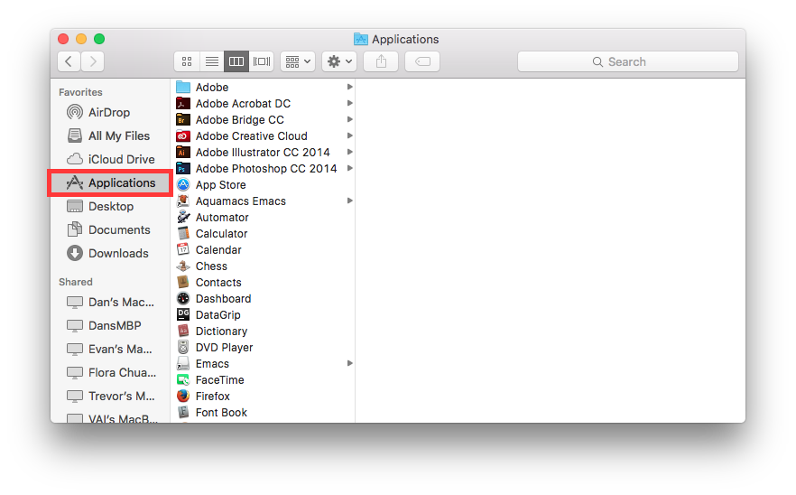

.. Anthony's Teaching Documentation documentation master file, created by
   sphinx-quickstart on Thu Jul 14 13:48:37 2016.
   You can adapt this file completely to your liking, but it should at least
   contain the root `toctree` directive.

What is the Terminal and what is its uses?
========================================== 
The terminal can basically be used for everything, like run programs, open and delete files.
Terminal provides a command line interface to control the UNIX based operating system.


How to get to the terminal on Mac:
----------------------------------
1. **open finder** 
2. **Go to Applications**



3. **Click Utilities**

.. image:: 'Utilities - Read the docs.png'
        :align: center
        :alt: Utilities
        
4. **Click Terminal**


Basic commands for terminal and their uses:
-------------------------------------------
```ls```: Used to view contents of a folder; ```ls /``` command is used to view all directories on the computer 

```cd```: Used to change directories *e.g ```cd desktop```* this changes the directory to the desktop

   ```cd``` when typed into the terminal by itself returns you to the home directory.  

:+1: just learned you can use emojis on here

```pwd```: Tells you what directory you are in; Stands for *print working directory*; useful when moving through directories

```mkdir```: This makes a directory where you are located

```rmdir```: This command removes a directory; you must be outside of a directory to delete it


Contents:

.. toctree::
   :maxdepth: 2


Indices and tables
==================

* :ref:`genindex`
* :ref:`modindex`
* :ref:`search`

