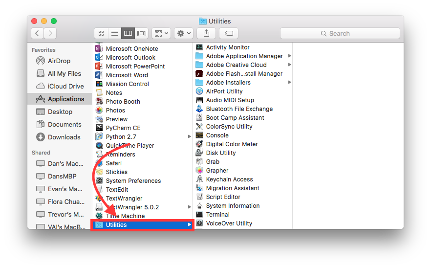

.. Anthony's Teaching Documentation documentation master file, created by
   sphinx-quickstart on Thu Jul 14 13:48:37 2016.
   You can adapt this file completely to your liking, but it should at least
   contain the root `toctree` directive.

What is the Terminal and what is its uses?
========================================== 
The terminal can basically be used for everything, like run programs, open and delete files.
Terminal provides a command line interface to control the UNIX based operating system.

How to get to the terminal on Mac:
----------------------------------
1. **open finder** 

        
2. **Go to Applications**

3. **Click Utilities**

        
4. **Click Terminal**

       

Basic commands for terminal and their uses:
-------------------------------------------
``ls``: Used to view contents of a folder; ``ls /`` command is used to view all directories on the computer 

``cd``: Used to change directories *e.g* ``cd desktop`` this changes the directory to the desktop  

``cd`` when typed into the terminal by itself returns you to the home directory.  

``pwd``: Tells you what directory you are in; Stands for *print working directory*; useful when moving through directories

``mkdir``: This makes a directory where you are located

``rmdir``: This command removes a directory; you must be outside of a directory to delete it

``Man`` pages: the ``man`` command gives a manual for everything such as ``ls`` ``cd`` and even itself

``touch``: This command creates an empty file

``cat``: This allows you to view the entire contents of a file stands for "catenate."

``nano``: This allows you to create and edit files

``mv``: This command is used to move files and also to rename them; to move them you type mv whatyouwantmoved where; to rename a file you type mv nameoffile newname

you can move and cp multiple files at once using wildcards such as ``*``

``cp``: This is used to copy files and directories

``rm``: This is used to delete files; *warning, very dangerous, I recommend using* ``rm -i`` *to be safe*

counting characters in a file: ``ls -l`` includes the file size ``wc`` tells number of line, words, characters in a specific file. ``wc -l``, ``wc -w``, ``wc -c`` gives a specific statistic

matching files with grep: use "grep keyword filename" to to search for specific words in specific lines. ``-i`` ignore case, ``-w`` only match whole words, ``-v`` show lines that dont match a pattern.

using tab completion: using tab helps you type faster, once you began typing a command that is unique you can press tab and it should complete the command

combining unix commands with pipes: use ``|`` to combine unix commands.

Contents:

.. toctree::
   :maxdepth: 2

Indices and tables
==================

* :ref:`genindex`
* :ref:`modindex`
* :ref:`search`

