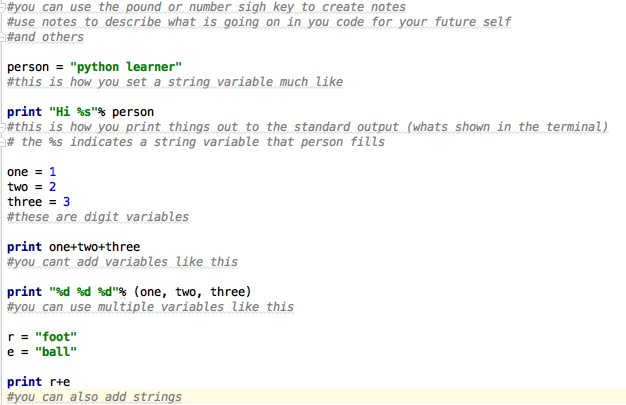

.. _python:

Python
======

What is python and what is it's uses?
-------------------------------------
Python is a high level, general purpose, programming language.

Tutorial
========
Step 0
------
Python is much like bash scripting. We should find a text editor for python. I use `Pycharm <https://www.jetbrains.com/pycharm/download/>`_. Download one you like and learn how to use it.

Step 1: Variables
-----------------

