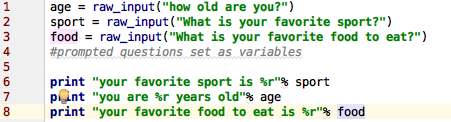
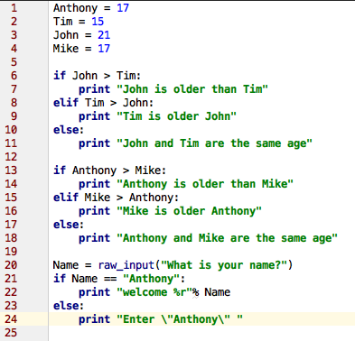
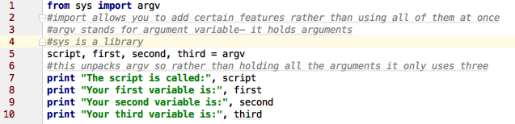
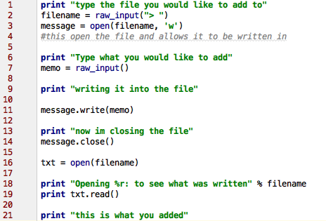
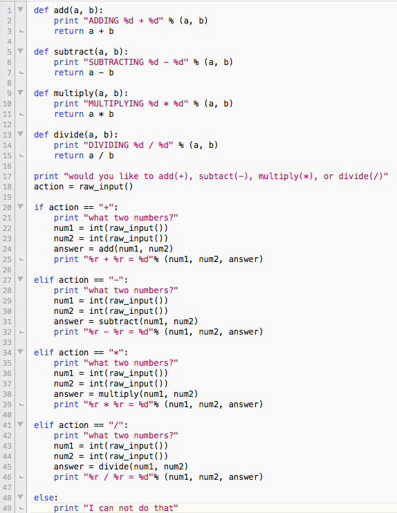
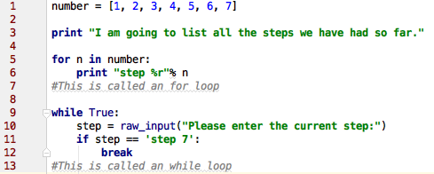
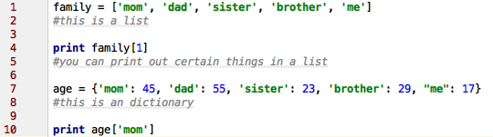

.. _python:

Python
======

What is python and what is it's uses?
-------------------------------------
Python is a high level, general purpose, programming language.

Tutorial
--------
Step 0
------
Python is much like bash scripting. We should find a text editor for python.
I use `Pycharm <https://www.jetbrains.com/pycharm/download/>`_. Download one you like and learn how to use it.
Create a directory named ``Learning_Python``. Inside this directory you should put all the files to this tutorial.

Step 1: Variables
-----------------

.. image:: step1python_rtd.png
        :align: center
        :height: 400 px
        :width: 400 px
        :alt: Variables

You run python files by typing ``python nameoffile.py`` for example ``python step1.py``

Step 2: User input
------------------
+------------+-------------------------------------------------------------+
| ESCAPE     | WHAT IT DOES.                                               |
+============+=============================================================+
| \\         | Backslash (\)                                               |
+------------+-------------------------------------------------------------+
| \'         | Single-quote (')                                            |
+------------+-------------------------------------------------------------+
| \"         | Double-quote (")                                            |
+------------+-------------------------------------------------------------+
| \a         | ASCII bell (BEL)                                            |
+------------+-------------------------------------------------------------+
| \b         | ASCII backspace (BS)                                        |
+------------+-------------------------------------------------------------+
| \f         | ASCII formfeed (FF)                                         |
+------------+-------------------------------------------------------------+
| \n         | ASCII linefeed (LF)                                         |
+------------+-------------------------------------------------------------+
| \N{name}   | Character named name in the Unicode database (Unicode only) |
+------------+-------------------------------------------------------------+
| \r         | Carriage Return (CR)                                        |
+------------+-------------------------------------------------------------+
| \t         | Horizontal Tab (TAB)                                        |
+------------+-------------------------------------------------------------+
| \uxxxx     | Character with 16-bit hex value xxxx (Unicode only)         |
+------------+-------------------------------------------------------------+
| \Uxxxxxxxx | Character with 32-bit hex value xxxxxxxx (Unicode only)     |
+------------+-------------------------------------------------------------+
| \v         | ASCII vertical tab (VT)                                     |
+------------+-------------------------------------------------------------+
| \ooo       | Character with octal value ooo                              |
+------------+-------------------------------------------------------------+
| \xhh       | Character with hex value hh                                 |
+------------+-------------------------------------------------------------+

        
Step 3: If/ Else Statements
---------------------------

        
Step 4: Argv
------------
Any time you run a script using ``argv`` you must pass it arguments. To run this script you type the usual ``python step4.py`` but you also have to pass it 3 arguments.
It should look like ``python step4.py Batman Robin Joker``. Any three arguments work.

        
Step 5: Files
-------------
+----------------+--------------------------------------------------------------------------+
| close          | Closes the file. Like File->Save.. in your editor.                       |
+----------------+--------------------------------------------------------------------------+
| read           | Reads the contents of the file. You can assign the result to a variable. |
+----------------+--------------------------------------------------------------------------+
| readline       | Reads just one line of a text file.                                      |
+----------------+--------------------------------------------------------------------------+
| truncate       | Empties the file. Watch out if you care about the file.                  |
+----------------+--------------------------------------------------------------------------+
| write('stuff') | Writes "stuff" to the file.                                              |
+----------------+--------------------------------------------------------------------------+

You must create a file before running this script. type ``touch test.txt`` into the command line and it will create an empty text file.
        
Step 6: Calculator & Functions
------------------------------

Step 7: Loops
-------------

Step 8: dictionaries and Lists
------------------------------

