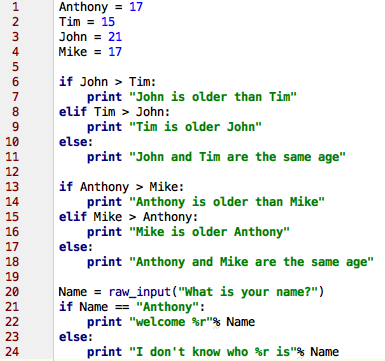

.. _python:

Python
======

What is python and what is it's uses?
-------------------------------------
Python is a high level, general purpose, programming language.

Tutorial
========
Step 0
------
Python is much like bash scripting. We should find a text editor for python.
I use `Pycharm <https://www.jetbrains.com/pycharm/download/>`_. Download one you like and learn how to use it.
Create a directory named ``Learning_Python``. Inside this directory you should put all the files to this tutorial.

Step 1: Variables
-----------------

.. image:: step1python_rtd.png
        :align: center
        :height: 400 px
        :width: 400 px
        :alt: Variables

You run python files by typing ``python nameoffile.py`` for example ``python step1.py``

Step 2: User input
------------------
+------------+-------------------------------------------------------------+
| ESCAPE     | WHAT IT DOES.                                               |
+============+=============================================================+
| \\         | Backslash (\)                                               |
+------------+-------------------------------------------------------------+
| \'         | Single-quote (')                                            |
+------------+-------------------------------------------------------------+
| \"         | Double-quote (")                                            |
+------------+-------------------------------------------------------------+
| \a         | ASCII bell (BEL)                                            |
+------------+-------------------------------------------------------------+
| \b         | ASCII backspace (BS)                                        |
+------------+-------------------------------------------------------------+
| \f         | ASCII formfeed (FF)                                         |
+------------+-------------------------------------------------------------+
| \n         | ASCII linefeed (LF)                                         |
+------------+-------------------------------------------------------------+
| \N{name}   | Character named name in the Unicode database (Unicode only) |
+------------+-------------------------------------------------------------+
| \r         | Carriage Return (CR)                                        |
+------------+-------------------------------------------------------------+
| \t         | Horizontal Tab (TAB)                                        |
+------------+-------------------------------------------------------------+
| \uxxxx     | Character with 16-bit hex value xxxx (Unicode only)         |
+------------+-------------------------------------------------------------+
| \Uxxxxxxxx | Character with 32-bit hex value xxxxxxxx (Unicode only)     |
+------------+-------------------------------------------------------------+
| \v         | ASCII vertical tab (VT)                                     |
+------------+-------------------------------------------------------------+
| \ooo       | Character with octal value ooo                              |
+------------+-------------------------------------------------------------+
| \xhh       | Character with hex value hh                                 |
+------------+-------------------------------------------------------------+

.. image:: step2python_rtd.png
        :align: center
        :height: 400 px
        :width: 400 px
        :alt: UserInput
        
Step 3: If/ Else Statements
---------------------------

        
